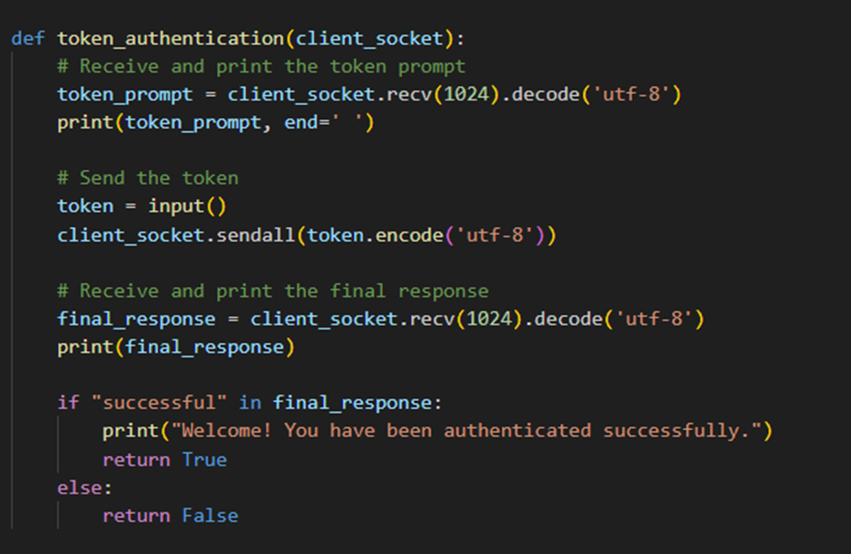

# Authentication and authorization between simulated device and controller 

## Authentication and authorization between simulated device and controller prototype to investigate and demonstrate how to reduce the risk of unauthorized users manipulating the system.

## Introduction:

In relation to the system modelled in part 1, this prototype aims to investigate and demonstrate how implementing robust authentication and authorization mechanisms will significantly reduce the risk of unauthorized users manipulating the system. as previously mentioned in the system modelled in part 1, one of the vulnerabilities found was authorization and authentication between device and controller. Poor authorization and authentication protocols enable cybercriminals to manipulate the system and carry out unauthorised actions (Botas, 2016). 
This prototype mitigates this risk by implementing three authentication and authorization methods such as token as another factor of authentication, max tries of 3 before server lock user out and the use of asterisk to mask the password.

## Code decomposition
## Server.py
### Importing modules:

### Create and configure server socket:

### Define username and password:

### Define maximum login:

### Define token function:

 

### Define client handling function:

### Accepting connection loop:

## Server.py

### Pwinput library need to be installed for the application to run:

### Importing modules:

### Create and connect client socket:

### Token authentication function:

### Define attempt range:

### Password masking:

### Client interaction:

## program video demonstration 

## usage

1. first launch the server then the client, server will listen for a connection by displaying waiting for a connection... and the client will ask for username.

2. from the server code copy the username and password and emter username at the client end, then it will request for a password, enter the password you copied the password will be masked as asterisk. 

3. if you enter correct username and password client will login successful.

4. if you enter incorrect username or password client will display invalid credentials and the remianing attempts

5. if both username and password is correct client will request for token entry.

6. if token is entered incorrectly, Invalid token! Please try again. message will be displayed 

7. if token is ented correctly, Welcome! You have been authenticated successfully. message will be displayed.

8. The server side will display User mohammed authenticated correctly.

## References: 

* Alvaro Botas, Juan F. Garcıa, Javier Alonso, 2016. Security Assessment Methodology for MobileApplications, University of Leon, Spain Leon, Spain.

